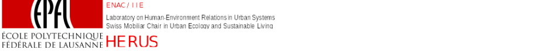

 
Laboratory for Human-Environment Relations in Urban Systems
 
École polytechnique fédérale de Lausanne
Prof. Dr. Claudia R. Binder, Susan Mühlemeier, Livia Fritz, Franziska Meinherz, Joao Meirelles, Thomas Bauwens, Jonas Mehr, Thibaud Rossel

---
