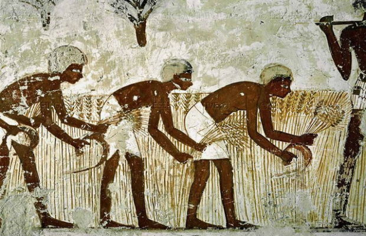

Laboratory for Human-Environment Relations in Urban Systems
 
École polytechnique fédérale de Lausanne

 
joao meirelles

---

where are cities coming from?
 

+++
the conventional thesis
 

agriculture   ->   cities

+++
another possibility
 

interaction desire   ->   cities

   Çatalhöyük - James Mellaart   

---

what are cities doing?
 

+++

scaling

---

whow to make it more efficient (and fun) ?
 

+++

entropy

---
thanks
