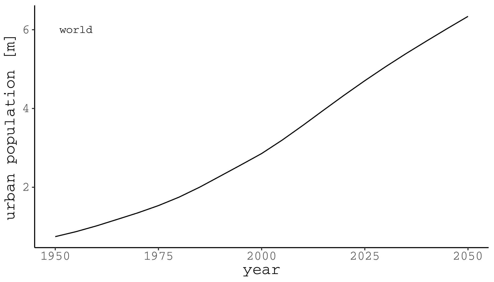

 
Laboratory for Human-Environment Relations in Urban Systems
 
École polytechnique fédérale de Lausanne
 
Prof. Dr. Claudia R. Binder, Susan Mühlemeier, Livia Fritz, Franziska Meinherz, Joao Meirelles, Thomas Bauwens, Jonas Mehr, Thibaud Rossel

---

---
urban growth

+++
global population is going urban

+++
global population is going urban

more in some areas than others
+++

+++

---
urban impacts
+++

+++

---
urban sustainability