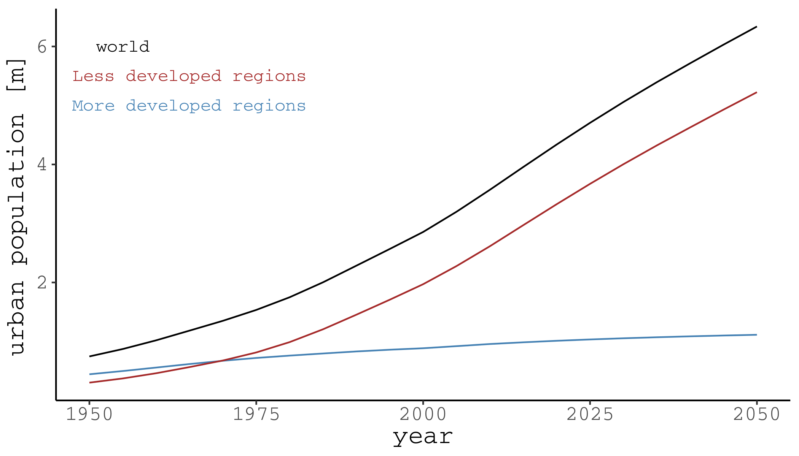
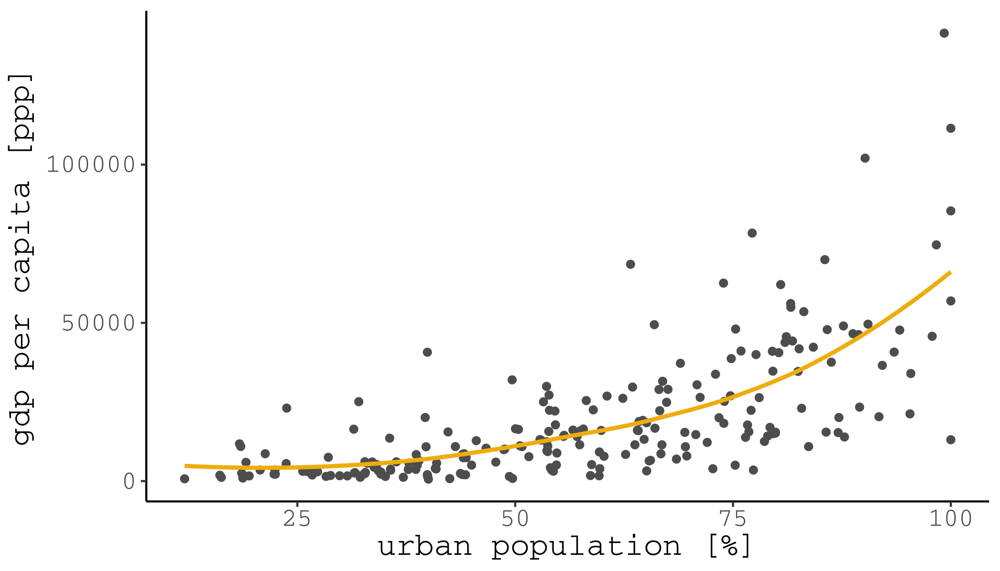
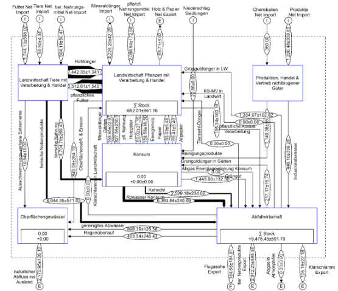

 
École polytechnique fédérale de Lausanne
 
Prof. Dr. Claudia R. Binder, Susan Mühlemeier, Livia Fritz, Franziska Meinherz, Joao Meirelles, Thomas Bauwens, Jonas Mehr, Thibaud Rossel

---

---

---
urban growth

+++
the world is going urban

+++
the world is going urban

+++
global population is going urban

+++
as cities grow bigger, they become    denser

+++
as cities grow bigger, they become    richer

+++
as cities grow bigger, they become    more unequal

---
urban impacts
+++

+++
the urban metabolism

+++
e.g.:    dynamics of the urban metabolism

+++
e.g.:    drivers of energy consumption

---
urban sustainability

+++
e.g.:    transition in material flows

+++
e.g.:    transition in energy consumption

+++
e.g.:    transition towards decentralized regional energy autonomy

---
